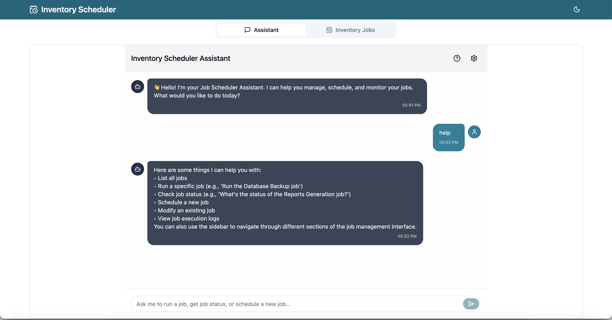
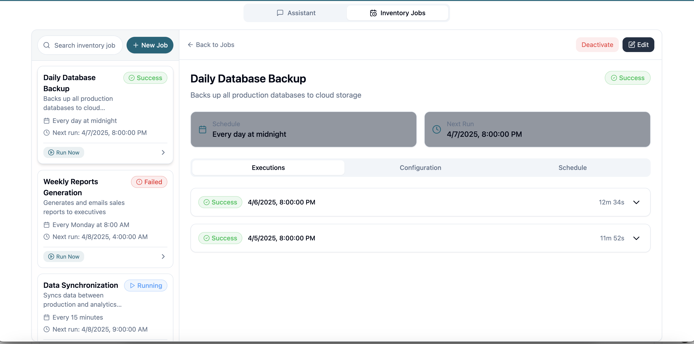
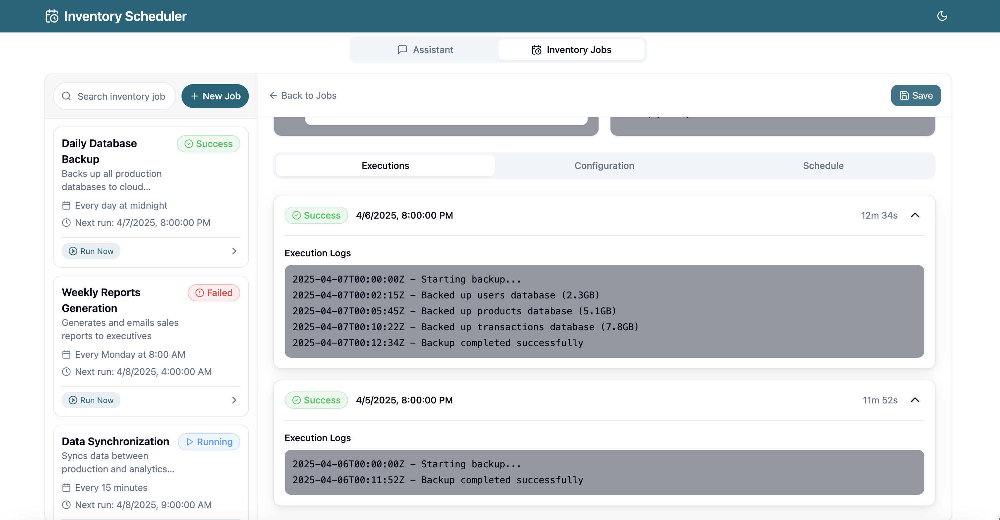
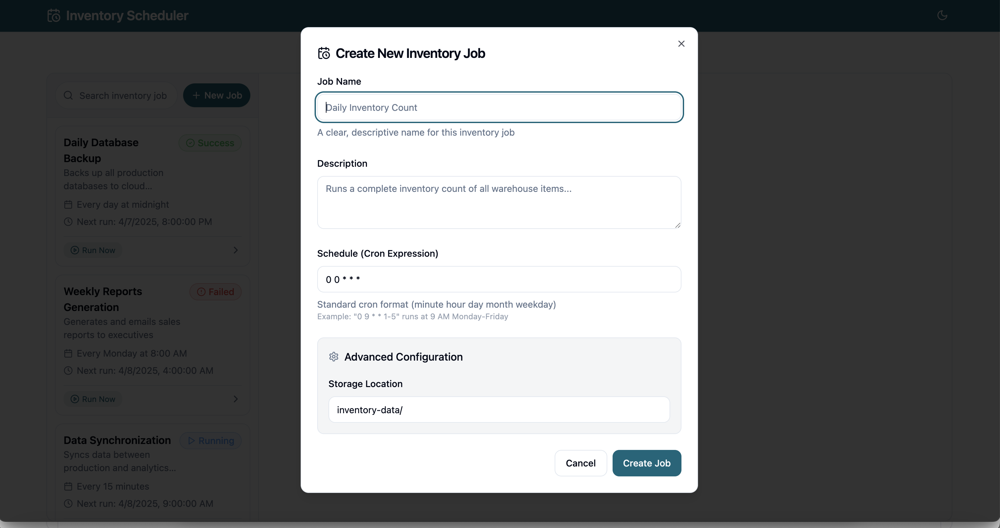
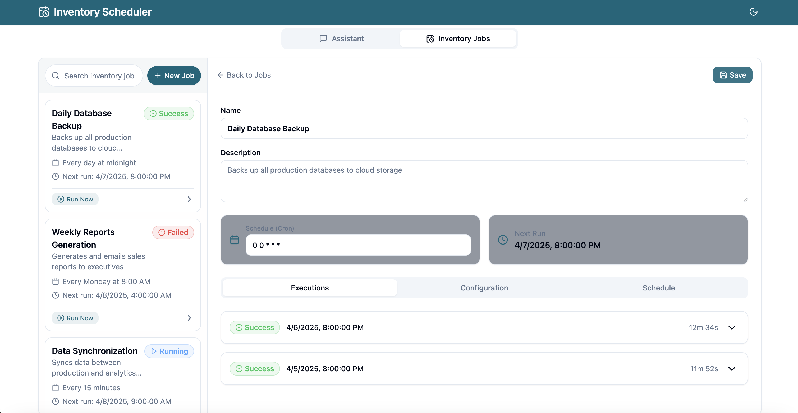

# 🚀 Job Management Chatbot UI

A modern, Apple-inspired chatbot interface for managing job configurations, scheduling, execution, and status tracking. This UI is designed with an emphasis on elegance, responsiveness, and exceptional user experience, making job operations simple and intuitive.

---

## 🖼️ Screenshots

### 💬 Chat Interface

> The main conversational interface where users can interact with the job management system in a human-like way.  
> Stylish message bubbles with smooth animations offer a familiar and comfortable experience for triggering and tracking jobs.

---

### 📋 Job List View

> Visually appealing, glass-style job tiles that summarize each job’s current state.  
> Quick-action buttons like **Run**, **Cancel**, and **Logs** make managing jobs instantaneous and efficient.

---

### ⚙️ Job Configuration Panel

> A full-featured configuration drawer that allows users to define or modify job settings.  
> Includes form fields for job name, schedule (cron), retry attempts, jitter, and notification toggles with built-in validations.

---

### 🆕 Create Job

> A guided form that allows users to create new job configurations seamlessly.  
> Dropdowns, tooltips, and real-time validation help ensure correctness and user convenience.

---

### ✏️ Edit Job

> Allows users to update existing job parameters such as schedules, retry count, or job logic.  
> Intuitive layout with highlighted fields and a confirmation mechanism for accidental changes.

---
